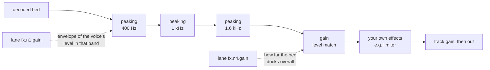

**Plugin installs:** Before setup or freshness commands, follow [plugin execution rules](../hyperframes/references/plugin-installation.md) when this skill is inside a HyperFrames plugin. Standalone installs keep the update instructions below.

# HyperFrames Audio

A mix is a set of relationships, not a stack of processors. Two tracks that each
sound right alone can be unlistenable together, and the fix is almost never "turn
one down" — it is finding what they are fighting over and giving it to whichever
one needs it. Every tool here exists to express one of those relationships.

Effects live on the element as `data-fx-chain`, and preview and render run the
same Web Audio graph — the studio in a live context, the engine in an offline one
inside the browser it already drives. There is one implementation of each effect,
so what you hear while scrubbing is what gets written. You never tune twice.

Clip timing remains `/hyperframes-core`: audio/video trims and source ranges use
`data-start`, `data-duration`, and `data-media-start`, and crossfades overlap
clips on different tracks. This skill owns placed-track fade-in/fade-out,
crossfade envelopes, track gain/track volume, volume and effect automation,
ducking/voiceover carve, and the effect chain. `/media-use` owns sourcing,
generation, and preprocessing.

Constant `data-playback-rate` (`0.1..10`) is render-safe for picture and
pitch-preserved sound when matching audio/video elements use the same timing,
source offset, and rate. A speed ramp is a `rate` lane in `data-automation`
(see `docs/reference/speed-ramps`); it wins over the constant and keeps pitch
in preview and render. HyperFrames does not
provide automatic waveform sync or drift correction.
For copyable cut/crossfade/retime recipes, use `/hyperframes-core` → `references/creator-editing-recipes.md`.

Three attributes carry everything, on the audio/video element itself — or, for
the first two, on an `<hf-audio-group>` bus (see "One bus for many tracks"):

| Attribute         | Holds                                                     |
| ----------------- | --------------------------------------------------------- |
| `data-fx-chain`   | the effects, in signal order                              |
| `data-automation` | envelopes on this track's volume or its effect parameters |
| `data-fx-carve`   | the carve's own settings, so it can be re-derived         |

The shipped effect families are gain, EQ (highpass, lowpass, peaking, shelves),
compressor, limiter, gate, saturate, delay, reverb, chorus, phaser, and bitcrush.

Exact JSON for each, and the rules a lane must satisfy: `references/attributes.md`.
Every effect with its parameters, ranges and units: `references/fx-registry.md`.
How to work out what is wrong with a file you cannot hear:
`references/diagnosis.md`.
**Presets, named jobs and one-knob profiles, plus a symptom-to-fix table:
`references/presets.md`** — read that before hand-building a chain, because one
of the presets or named jobs usually already names the problem.

## How it fits together

Two authoring surfaces write those attributes; two runtimes read them through the
same builders. That shared middle is why preview predicts the render.

```mermaid
flowchart TB
  voice["voice track<br/>media file"]
  bed["music bed<br/>media file"]

  subgraph AUTHOR["Authoring — the only things that write attributes"]
    panel["Studio<br/>Voiceover carve control"]
    script["scripts/carve.mjs<br/>detects the pair, dynamic by default"]
    analysis["core/audioCarve.ts<br/>carveProfile · analyseCarveBands<br/>analyseCarveDuck · analyseCarveDynamics"]
    panel --> analysis
    script --> analysis
  end

  voice --> analysis
  bed --> analysis

  subgraph ATTRS["Written onto the bed element"]
    carveAttr["data-fx-carve<br/>source · strength · dynamic"]
    chainAttr["data-fx-chain<br/>peaking xN + gain, tagged fromCarve"]
    autoAttr["data-automation<br/>a lane per carved parameter"]
  end

  analysis --> carveAttr
  analysis --> chainAttr
  analysis --> autoAttr

  subgraph SHARED["One implementation, read by both"]
    build["audioFxGraph.ts · buildFxChain"]
    sched["audioFxAutomation.ts · scheduleChainAutomation"]
  end

  chainAttr --> build
  autoAttr --> sched

  build --> preview["Preview<br/>live AudioContext<br/>attachElementFxChain"]
  sched --> preview
  build --> render["Render<br/>OfflineAudioContext in the headless browser<br/>applyAudioFxChain"]
  sched --> render

  preview --> heard["what you hear while scrubbing"]
  render --> wav["processed WAV<br/>+ chainTailSeconds so the mix lets the tail through"]
  wav --> mix["engine · audioMixer<br/>volume lane baked into the PCM here, not in the graph"]
  mix --> out["the rendered mix"]

  edit["editing the attribute mid-playback"] -.->|MutationObserver| preview
```

The carve's own settings are never read at playback — the chain and lanes it
produced are what play. `data-fx-carve` exists so strength can be changed on an
existing carve instead of guessed back out of the filters.

Inside a carved bed the signal runs through the dips first, then the level match,
then anything you built yourself — which is why a limiter you add still acts as
the last ceiling:

A static carve is the same graph with fixed values and no lanes at all.

## Detailed guide
Symptom diagnosis, effect families, the voiceover carve, submix buses and automation are in the reference. Read `references/mixing-guide.md` (table of contents at the top) before doing this work.

## Verify

Almost no static gate covers the mix. The linter reads `data-automation` for
exactly one conflict — `audio_volume_double_automation`, a volume lane on a track
that also has a GSAP tween on `volume`, where the lane wins and the tween is
ignored — plus `audio_volume_tween_overrides_gain`, an authored `data-volume`
on a track whose `volume` is tweened, where the tween's values are absolute and
replace that gain instead of scaling it. Nothing validates the
chain or the effect lanes at all. What
enforces those is the render: a chain it cannot parse fails the whole mix rather
than quietly writing the dry signal, because a mix that sounds plausible and is
wrong is worse than a refusal. Preview is the opposite by design: an unreadable
chain plays dry so the composition stays workable.

A lane pointing at a node the chain does not have is pruned on read, not an
error — so a typo'd `nodeId` costs you the envelope silently. Read the ids back
out of the chain rather than assuming what was minted.

Effects with a tail (`reverb`, `delay`) make the rendered track **longer** than
its source, and the mix is told how much by the chain. So a bed with reverb no
longer ends exactly at its `data-duration`; that is expected, not a bug.

Beyond that, a mix is verified by rendering and listening. For a carve: the voice
should be legible without the bed sounding hollowed, and with `dynamic` the bed
should come back up between phrases rather than staying flat. If the bed sounds
notched rather than simply quieter under the voice, the strength is too high —
that is the one failure mode with an obvious sound.
